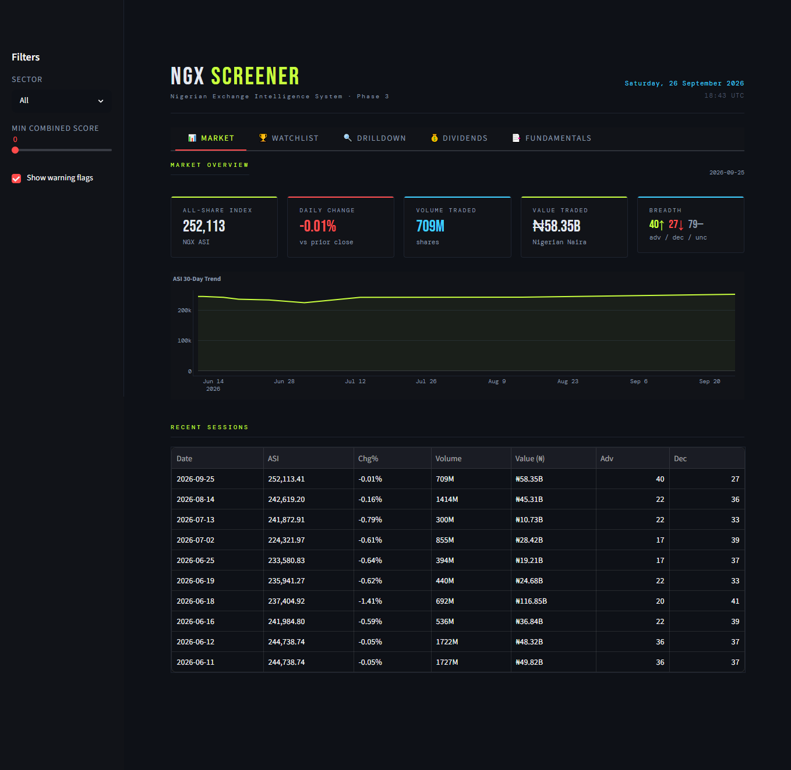

# NGX Screener

NGX Screener collects live Nigerian Exchange data, scores every eligible stock on momentum, dividends, and fundamentals, and serves the results through a Streamlit dashboard and a daily text report. Underneath the tooling sits a single research question: which quantitative signals actually predict returns on the NGX?

Nigeria has no Bloomberg for the NGX and no dedicated quant research terminal covering it. This started as a personal tool — a way to get better information before buying stock — and grew into something larger than originally planned. Personal utility still comes first, but the scope has expanded toward building actual factor research infrastructure for a market that has almost none.



## Why NGX

Global factor research mostly describes the US and Europe. Momentum, value, and quality premia come with decades of S&P and Stoxx evidence — and no guarantee they behave the same way in Lagos.

The NGX differs in ways that matter for quant work: fewer listings, thinner liquidity, wider spreads, and a market where a handful of large caps dominate index moves. Signals built for deep, liquid markets can easily misfire here. You find out by testing locally, not by importing assumptions. There is also no dedicated financial intelligence platform for NGX retail investors — information sits scattered across NGX filings, company IR pages, Nairametrics, and Proshare, with no central tool that aggregates and scores it.

That gap is exactly what makes the market interesting. 146 stocks is small enough to cover completely and structured enough to score systematically, and almost nobody publishes rigorous factor work on it.

## What it does

A daily run pulls all 146 listings from the NGX Pulse API, filters down to the liquid tradeable set, scores each survivor on three dimensions, ranks them, and writes a plain-text intelligence report. A weekly refresh updates dividend history per watchlist stock (stale caches re-fetch, fresh ones don't). When companies publish new quarterly or annual reports, drop the PDFs in `data/pdfs/` and the extractor pulls EPS, ROE, revenue growth, and PAT growth out via Qwen. The dashboard carries the same data across six tabs — Market, Watchlist, Drilldown, Dividends, Fundamentals, Raw Data — for days when you want to poke around instead of reading the report.

## Scoring

Each stock gets three 0–100 scores. When PDF-extracted fundamentals exist, they combine as momentum × 0.5 + dividend × 0.3 + fundamentals × 0.2 (`M50+D30+F20`). When they don't, momentum and dividend split the weight (`M60+D40`) so uncovered stocks still rank fairly. Stocks without PDF data get a neutral 45 on fundamentals — benefit of the doubt, not a penalty.

### Momentum (0–100)

| Component | Max | Logic |
|---|---|---|
| 7-day return | 40 | ≥10% = 40, 5–10% = 25, 0–5% = 10, negative = 0 |
| Volume vs 30-day avg | 30 | >2x = 30, 1.5x = 20, 1x = 10, <1x = 0 |
| Price stability | 20 | Inverse of daily swing — stable scores higher |
| Sector trend | 10 | Net advancers in the sector this week |

Volume needs ~30 days of daily history before it means much.

### Dividend (0–100)

| Component | Max | Logic |
|---|---|---|
| Trailing 12-month yield | 40 | ≥8% = 40, 5–8% = 28, 3–5% = 15, <3% = 5 |
| Payout consistency | 30 | 5+ years = 30, 3–4 = 20, 1–2 = 10 |
| DPS growth trend | 20 | Growing YoY = 20, flat = 10, declining = 0 |
| Payout timing | 10 | Ex-date within 6 months = 10, 6–12 = 5, >12 = 0 |

### Fundamentals (0–100)

| Component | Max | Logic |
|---|---|---|
| EPS / profit growth | 30 | Growing >5% = 30, flat = 15, declining = 0 |
| Return on equity | 25 | ≥25% = 25, 15–25% = 18, 10–15% = 10 |
| Revenue growth | 25 | ≥20% = 25, 10–20% = 18, 0–10% = 10, negative = 0 |
| PAT growth | 20 | ≥20% = 20, 0–20% = 12, −20–0% = 5, <−20% = 0 |

### Screener filters

| Filter | Value | Reason |
|---|---|---|
| Price range | ₦50 – ₦700 | Affordable for retail capital |
| Minimum daily volume | 500,000 shares | Liquid enough to enter and exit |
| Minimum market cap | ₦50 billion | Excludes micro-caps and shells |
| Maximum daily swing | 10% | Excludes erratic / manipulated names |
| Null volume | Excluded | No trading activity, no signal |

Around 15–20 listings pass at any given time.

## Setup

You need Python 3.10+, a free [NGX Pulse](https://ngxpulse.ng/api) key, and a free-tier [DashScope](https://dashscope-intl.aliyuncs.com) key for Qwen.

```bash
git clone <repo-url> ngx-screener
cd ngx-screener
pip install -r requirements.txt
```

Create `config.py` in the project root. The file is gitignored — never commit keys:

```python
NGX_API_KEY = "your_ngx_pulse_key"
QWEN_API_KEY = "your_dashscope_key"
QWEN_MODEL = "qwen-plus"

DB_PATH = "database/ngx.db"
SNAPSHOT_DIR = "data/snapshots"
DIVIDEND_DIR = "data/dividends"
PDF_DIR = "data/pdfs"
EXTRACTED_DIR = "data/extracted"
REPORTS_DAILY = "reports/daily"
REPORTS_WEEKLY = "reports/weekly"
LOG_PATH = "logs/run.log"

MIN_PRICE = 50
MAX_PRICE = 700
MIN_VOLUME = 500000
MIN_MARKET_CAP = 50_000_000_000
MAX_DAILY_SWING = 0.10
EXCLUDE_NULL_VOLUME = True

MOMENTUM_WEIGHT = 0.6
DIVIDEND_WEIGHT = 0.4

WATCHLIST = ["GTCO", "ZENITHBANK", "STANBIC", "NB", "MTNN",
             "DANGSUGAR", "FIRSTHOLDCO", "OANDO", "FCMB", "VITAFOAM"]
```

Then initialize the database:

```bash
python main.py --mode setup
```

## Running it

```bash
python main.py --mode daily    # fetch prices + score + report (~3 API calls)
python main.py --mode weekly   # refresh dividends + full pipeline (~12 API calls)
python main.py --mode score    # re-score from DB + report (zero API calls)
python main.py --mode report   # report from existing scores (zero API calls)
```

```bash
python src/scoring/fundamentals.py   # extract new PDFs via Qwen, update fund scores
streamlit run app/app.py             # open the dashboard
```

Name PDFs `SYMBOL_PERIOD.pdf` (e.g. `GTCO_FY2025.pdf`). The extractor also reads the company name out of the PDF text, so naming helps but isn't required.

## Stack

| Layer | Technology | Status |
|---|---|---|
| Language + database | Python 3.10+, SQLite | Live |
| Market data + PDF parsing | requests, pdfplumber | Live |
| PDF financial extraction | Qwen via DashScope | Live |
| Dashboard | streamlit + plotly | Live |
| Factor IC analysis | alphalens | Planned (v2.0) |
| Strategy tearsheets | quantstats-reloaded | Planned (v3.0) |
| Portfolio optimization | skfolio | Planned (v4.0) |

Free-tier API budget is 100 req/day. Daily runs cost ~3 calls, weekly refresh ~12. Dividend responses cache per stock with a 7-day TTL.

## Roadmap

| Version | Description | Status |
|---|---|---|
| v0.x | Core pipeline: data collection, 3-D scoring, Streamlit dashboard | Done |
| v1.0 | Factor Engine: registry-based scoring with per-stock attribution | Next |
| v1.5 | Historical data: NGX OHLCV back to 2016, macro data, corporate actions | Planned |
| v2.0 | Factor Validation Lab: IC, quintile returns, hit rate per NGX factor | Planned |
| v2.5 | Hypothesis Registry: persistent research workflow with run cards | Planned |
| v3.0 | Backtesting Engine: walk-forward strategy testing, quantstats tearsheets | Planned |
| v4.0 | Portfolio Lab: skfolio allocation, risk analytics, optimization | Planned |
| v5.0 | AI Research Analyst: Qwen interpretation layer over deterministic engine | Planned |
| v6.0 | Kronos: ML forecasting signal, promoted only if it beats factor baselines | Planned |

Each version tests the assumptions of the previous one before adding new complexity.

*Not financial advice. Scores come from backtested heuristics, not recommendations — verify everything before trading.*

## License

MIT — see [LICENSE](LICENSE).
