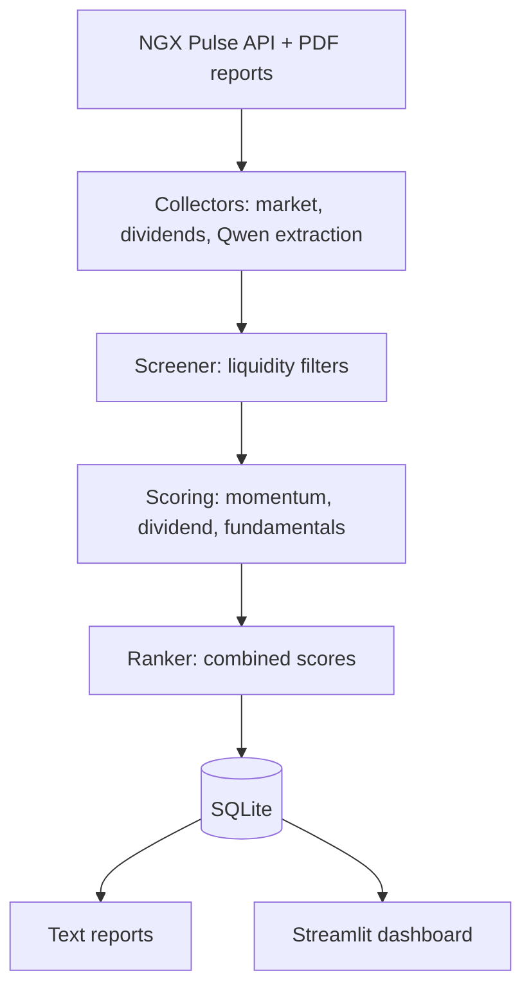

# NGX Screener

A quantitative stock screening and factor research project for the Nigerian Exchange (NGX).

[](https://www.python.org/)
[](LICENSE)


<!-- TODO: add screenshots for the ranked screener view, stock drilldown, and a sample daily report -->

## Why NGX?

Most published factor research describes developed markets. Momentum, value, and quality premia come with decades of US and European evidence, and none of that automatically transfers to Lagos.

The NGX differs in ways that matter for quant work: fewer listings, thinner liquidity, wider spreads, and an index dominated by a handful of large caps. Signals calibrated on deep, liquid markets can misfire here. The only way to know is to test them against local data.

That is also what makes the market worth covering. With 146 listings, one person can track the entire universe systematically, and almost nobody publishes rigorous factor work on it. The gap is the opportunity.

## What it does

The current pipeline runs like this:

NGX market data → liquidity filters → momentum/dividend/fundamental scoring → ranking → SQLite persistence and text report → Streamlit dashboard.

A daily run pulls all 146 listings from the NGX Pulse API, filters to the liquid tradeable set (usually 15 to 20 names), scores each one, and writes a plain-text intelligence report. A weekly refresh updates dividend history per watchlist stock. When companies publish new quarterly or annual reports, drop the PDFs in `data/pdfs/` and the extractor pulls EPS, ROE, revenue growth, and PAT growth out through Qwen (DashScope). The dashboard carries the same data across six tabs for days when you want to explore instead of reading the report.

## Scoring

Each eligible stock gets three 0–100 scores. When PDF-extracted fundamentals exist, the combined score is momentum × 0.5 + dividend × 0.3 + fundamentals × 0.2 (`M50+D30+F20`). When they don't, momentum and dividend split the weight (`M60+D40`) so uncovered stocks still rank fairly. Stocks without PDF data get a neutral 45 on fundamentals: benefit of the doubt, not a penalty.

### Momentum (0–100)

| Component | Max | Logic |
|---|---|---|
| 7-day return | 40 | ≥10% = 40, 5–10% = 25, 0–5% = 10, negative = 0 |
| Volume vs 30-day avg | 30 | >2x = 30, 1.5x = 20, 1x = 10, <1x = 0 |
| Price stability | 20 | Inverse of daily swing (stable scores higher) |
| Sector trend | 10 | Net advancers in the sector this week |

Volume needs roughly 30 days of daily history before it carries much information.

### Dividend (0–100)

| Component | Max | Logic |
|---|---|---|
| Trailing 12-month yield | 40 | ≥8% = 40, 5–8% = 28, 3–5% = 15, <3% = 5 |
| Payout consistency | 30 | 5+ years = 30, 3–4 = 20, 1–2 = 10 |
| DPS growth trend | 20 | Growing YoY = 20, flat = 10, declining = 0 |
| Payout timing | 10 | Ex-date within 6 months = 10, 6–12 = 5, >12 = 0 |

### Fundamentals (0–100)

| Component | Max | Logic |
|---|---|---|
| EPS / profit growth | 30 | Growing >5% = 30, flat = 15, declining = 0 |
| Return on equity | 25 | ≥25% = 25, 15–25% = 18, 10–15% = 10 |
| Revenue growth | 25 | ≥20% = 25, 10–20% = 18, 0–10% = 10, negative = 0 |
| PAT growth | 20 | ≥20% = 20, 0–20% = 12, −20–0% = 5, <−20% = 0 |

## Screener filters

| Filter | Value | Reason |
|---|---|---|
| Price range | ₦50 – ₦700 | Affordable for retail capital |
| Minimum daily volume | 500,000 shares | Liquid enough to enter and exit |
| Minimum market cap | ₦50 billion | Excludes micro-caps and shells |
| Maximum daily swing | 10% | Excludes erratic or manipulated names |
| Null volume | Excluded | No trading activity, no signal |

These are current project heuristics, not universal truths. They exist to keep the scored universe liquid and tradeable. If your capital base or risk tolerance differs, the values live in `config.py` and take seconds to change.

## Dashboard

Six tabs, all reading from the same SQLite database:

- **Market**: ASI trend, breadth, session history
- **Watchlist**: ranked eligible stocks with score breakdowns and warning flags
- **Drilldown**: per-stock price and volume charts, score history, dividend record, fundamentals panel
- **Dividends**: upcoming ex-dates plus historical dividend scores
- **Fundamentals**: side-by-side PDF-extracted metrics with comparison charts
- **Raw Data**: direct table explorer over the underlying data

```bash
streamlit run app/app.py
```

## Setup

Requirements: Python 3.10+, a free [NGX Pulse](https://ngxpulse.ng/api) key, and a free-tier [DashScope](https://dashscope-intl.aliyuncs.com) key for Qwen.

```bash
git clone https://github.com/ChuKuangren97/ngx-screener ngx-screener
cd ngx-screener
pip install -r requirements.txt
```

Create `config.py` in the project root. It is gitignored, so keys never get committed:

```python
NGX_API_KEY = "your_ngx_pulse_key"
QWEN_API_KEY = "your_dashscope_key"
QWEN_MODEL = "qwen-plus"

DB_PATH = "database/ngx.db"
SNAPSHOT_DIR = "data/snapshots"
DIVIDEND_DIR = "data/dividends"
PDF_DIR = "data/pdfs"
EXTRACTED_DIR = "data/extracted"
REPORTS_DAILY = "reports/daily"
REPORTS_WEEKLY = "reports/weekly"
LOG_PATH = "logs/run.log"

MIN_PRICE = 50
MAX_PRICE = 700
MIN_VOLUME = 500000
MIN_MARKET_CAP = 50_000_000_000
MAX_DAILY_SWING = 0.10
EXCLUDE_NULL_VOLUME = True

MOMENTUM_WEIGHT = 0.6
DIVIDEND_WEIGHT = 0.4

WATCHLIST = ["GTCO", "ZENITHBANK", "STANBIC", "NB", "MTNN",
             "DANGSUGAR", "FIRSTHOLDCO", "OANDO", "FCMB", "VITAFOAM"]
```

## Running the screener

```bash
python main.py --mode setup    # create database and tables (first run only)
python main.py --mode daily    # fetch prices, score, write report
python main.py --mode weekly   # refresh dividends, then run the daily pipeline
python main.py --mode score    # re-score from stored data, no API calls
python main.py --mode report   # regenerate the report from stored scores
```

```bash
python src/scoring/fundamentals.py   # extract new PDFs via Qwen, update fund scores
streamlit run app/app.py             # open the dashboard
```

Name PDFs `SYMBOL_PERIOD.pdf` (for example `GTCO_FY2025.pdf`). The extractor also reads the company name from the PDF text, so naming helps but is not required.

## Architecture

The project is a straight pipeline with no hidden state:



```
main.py                  # entry point: setup / daily / weekly / score / report
config.py                # keys, paths, filter thresholds (gitignored)
src/collectors/          # market_collector, dividend_collector (NGX Pulse)
src/ai/                  # qwen_extractor (PDF financial extraction)
src/filters/             # screener (liquidity filters)
src/scoring/             # momentum, dividend, fundamentals, ranker
src/database/            # schema + queries (7 tables)
src/reports/             # daily/weekly text report generator
app/                     # Streamlit dashboard (6 tabs)
data/                    # snapshots, dividend cache, PDFs, extractions (local)
```

## Stack

| Layer | Technology | Status |
|---|---|---|
| Language + database | Python 3.10+, SQLite | Live |
| Market data + PDF parsing | requests, pdfplumber | Live |
| PDF financial extraction | Qwen via DashScope | Live |
| Dashboard | streamlit + plotly | Live |
| Factor IC analysis | alphalens | Planned (v2.0) |
| Strategy tearsheets | quantstats-reloaded | Planned (v3.0) |
| Portfolio optimization | skfolio | Planned (v4.0) |

Anything marked Planned is not installed, imported, or called anywhere. The three planned libraries each belong to a specific roadmap version, which is where they stay until then.

## API budget

The free NGX Pulse tier allows 100 requests per day. A daily run costs about 3 calls (all listings, market overview, news). A weekly dividend refresh costs about 12 (one per watchlist stock plus the daily set). Dividend responses cache per stock with a 7-day TTL, and the collector caps itself below the daily limit, so normal use stays far from the ceiling.

## Roadmap

| Version | Description | Status |
|---|---|---|
| v0.x | Core pipeline: data collection, 3-D scoring, Streamlit dashboard | Done |
| v1.0 | Factor Engine: registry-based scoring with per-stock attribution | Next |
| v1.5 | Historical data: NGX OHLCV back to 2016, macro data, corporate actions | Planned |
| v2.0 | Factor Validation Lab: IC, quintile returns, hit rate per NGX factor | Planned |
| v2.5 | Hypothesis Registry: persistent research workflow with run cards | Planned |
| v3.0 | Backtesting Engine: walk-forward strategy testing, quantstats tearsheets | Planned |
| v4.0 | Portfolio Lab: skfolio allocation, risk analytics, optimization | Planned |
| v5.0 | AI Research Analyst: Qwen interpretation layer over deterministic engine | Planned |
| v6.0 | Kronos: ML forecasting signal, promoted only if it beats factor baselines | Planned |

Each version tests the assumptions of the previous one before adding new complexity.

## Research philosophy

Nothing here assumes established factors work on the NGX. The current scores are deterministic heuristics built from local data, and the roadmap exists to check them: collect history, measure information coefficients and quintile returns, keep what survives, drop what doesn't. If momentum turns out to be noise on this market, the honest result is to say so and move on.

## Limitations

Liquidity on the NGX is thin, so volume and stability signals are noisier than the same metrics would be elsewhere. Historical coverage in the current build starts when you start collecting (there is no bundled history yet; that arrives in v1.5). Qwen's PDF extraction can misread tables, so fundamentals carry extraction error on top of reporting error. The scores are unvalidated heuristics at this stage: no factor in v0.x has passed a forward-return test. Treat everything as a hypothesis with a number attached.

## Disclaimer

NGX Screener is a research and educational tool, not financial advice. Scores are generated from the project's data and heuristics and should not be treated as recommendations. Verify underlying information before making investment decisions.

## License

MIT. See [LICENSE](LICENSE).
